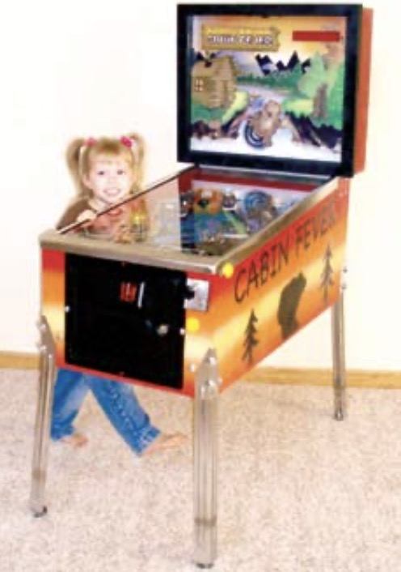

# cabin-fever

### One of the first homebrew pinball machines

<table><tr>
    <td style=center></td>
  <td style=center></td>
</tr></table>

## History
* 2022 - added [sound boards](https://www.adafruit.com/product/2210) and [dot matrix display](https://www.adafruit.com/product/902). [YouTube Video](https://www.youtube.com/watch?v=6KhJhX8kA1E).
* 2021 - shoot the blinking lights added.
* 2020 - improved play by adding another pop bumper up top and a second symetrical slingshot.
* 2007 - software updates and charity play at the Rocky Mountain Pinball Showdown. [Article in GameRoom Magazine](docs/GRM19-05.pdf?raw=true)
* 2006 - created, custom woodworking, metal, electronics, and seminar hosted at Pinball Expo Chicago.

## Overview

**TweenPin** is a 3/4 scale custom pinball machine. It consists of all the traditional pinball machine materials: a wood cabinet and playfield, lamps, solenoids, high current power supplies, flippers, targets, pop bumpers, 1 1/8" steel ball, tempered glass, a scoring display and of course an Atmel AVR (ATmega16) powered master control board.

Since the advent of the first commercially successful pinball machine (Gottlieb's Baffle Ball in 1931) pinball has seen its ups and downs. Commercial machines have quite a rich history, with varied and unique features. In more recent years, they've achieved a highly collectible status for home use.

Creating one's own pinball machine, utilizing real machine components, is a challenging and appealing project to many people. It offers the opportunity to build a fully custom, complex, and lasting entertainment device for the enjoyment of the entire family. There are however, many difficulties with such a project. Of concern is the overall style of the machine (and art), sourcing the wide range of necessary components, and of course there is the machine control issue. The project truly is a multidisciplinary effort in electronic design, embedded software, woodworking, mechanical design and art.

## Electronic subsystems

**Custom unregulated power supplies** step down wall power voltages down to 6 and 24 AC volts RMS using two high current transformers. Three diode bridges and two capacitors result in the generation of about 6, 8 and 36 DC volts. The 6VDC is used to power the machine's lamps. The 8VDC is used to power the circuit boards, and the 36VDC is used to power the solenoids.

**A custom display board** shows the current score and other status. It consists of four dual 1" tall yellow common cathode seven segment displays and a MAX7219. An LM317 performs onboard 5.0v linear regulation of the 8v input. The MAX part is a serial interfaced, programmable, 8 digit multiplexing, direct segment driver. The control board occasionally sends updates via SPI commands when a change to the display is required.

**A custom control board** is both the brains and brawn of the electronic subsystems. It consists mainly of a single ATmega16 master controller, IO expanders, filtered inputs, MOSFET high current outputs and euro style pluggable connectors. An LM317 performs onboard 5.0v linear regulation of the 8v input. The ATmega16 holds all the logic for rules and controls on the game.

A sound board provision allows an opportunity to expand this project.  The main control board can communicate to an additional board on the SPI bus through an extra chip select.  The control board can accept “sound completion” interrupts back as well over this bus.

## Control solutions

The TweenPin control board is a mere 42 square inches, while traditional machines use two square feet of circuit board to perform these same tasks.  Further, it solves many of the real-time control challenges experienced in all pinball machines and some particulars to having built a one-off machine with components from various manufactures and sources.  The TweenPin control system has the following unique features, which solve these challenges:
- Driving hobby servos
- Pulse width modulation (PWM) on solenoids
- In System Programming (ISP) connector is dual purposed as a SPI inter-board communications bus.
- MOSFETs are “over engineered” for ruggedness and simplicity.  The TO220 package are heavy duty for long life in harsh environments, as is the case with a pinball machine that’s enclosed for security reasons while in service on location. Pull-downs for failsafe operation.  High voltage and current ratings combined with a low Vgs requirement for standard logic drive.
- The machine itself busses a common voltage to all lamps and all solenoids.  The control boards are simplified in needing only to ground active outputs.

### Solenoid control with PWM
Pinball solenoids are designed to throw with a certain strength, a factor of the windings and voltage.  The TweenPin runs a slightly higher solenoid voltage than most machines and performs pulse width modulation on the solenoid outputs.  This allows tuning of each solenoid allowing for better balanced play.  This was particularly important for a machine that is 3/4 scale, since the playfield is smaller.  It also reduces concern over selecting among thousands of solenoid windings from many manufactures of pinball machine assemblies (like flippers, pop bumpers, drop targets, and hole kickers).  Instead it just becomes a mater of finding something mechanically sensible, and allowing the software to tune the parts for compatibility.

### Flipper control  
Standard flipper assemblies consist utilize a three lug coil.  This allows for a high current "hit" winding and a low current "hold" winding.  Traditional machines use an end of stroke switch (EOS) which either adds the hold winding in series, or instructs a separate flipper driver board to switch from the hit winding to the hold winding.  TweenPin goes one step further and eliminates the EOS.  The control MCU, senses the flipper button, activates a "hit" current level and after a few milliseconds adjusts to a 1/5 duty cycle PWM on for a "hold" current.  No EOS is required and solenoids don’t overhead when held.

### Pop-bumper control
Similar to the control and “hold” issues of flippers, pop-bumpers are driven with a software one-shot algorithm.

### High-speed and low-speed distinctions

I/O that has critical real-time requirements is distinguished from slower I/O.  Traditional pinball machines need several dedicated circuit cards to handle the "high-speed" requirements of flippers and pop bumpers.  The control board design simplifies things by utilizing a switch matrix and software to handle signals from the flipper and pop bumper inputs.  When a switch is activated (active low) it directly interrupts the processor. The ISR scans to find the switch that caused the interrupt and immediately activates the appropriate solenoid.  The reaction time between the switch input and solenoid output is not affected by the SPI bus of required for the IO expanders.

### Software design

The software is divided in to seven functional modules:
- **Tweenpin** This is the main program source.  It controls the distinction between attract and game modes and handles high level game sequencing operations.
- **Util** General utility functions, primarily centered around timing.
- **IO** IO initialization, low level communication routines for IO expanders and generic SPI.
- **Fast switches** Flipper and Pop bumper controls which require immediate response. All logic is handled in interrupt context.
- **Slow Switches** Handles the remaining game controls that do not require immediate response.  The logic is handled by main system loop.
- **Lamps** Independent controls for lamp states: On, Off, Flashing.
- **Solenoids** Independent controls for game solenoids: Single-Shot, Hold-with-PWM, Flashing.
- **Display** Handles seven segment font and control for the display board.

The overall system is driven by a 200Hz timer, which samples all switch states, handles control logic for the fast switches, and drives solenoids to allow for simple pulse-width-modulation.  Due to the large quantity of inputs to the system, all inputs are sampled within the 200Hz timer interrupt to determine if they have changed from their prior state.  If a change is detected, it is flagged for further processing.  

When powered on, the system starts out in attract mode, intended to attract players to the game.   This mode cycles through all the lights, flashing them in sequence.  Each light is flashed twice to create a “chasing” effect.  At the same time the seven segment display is sequenced to show “play pinball”.

The system is largely driven in response to inputs from switches.  The system is transitioned to game mode by the start button.  This sets off the lane loader solenoid so that the ball can be shot up into the playfield with the manual plunger.

There are several banks of targets on the machine.  When each target is hit the associated under-playfield lamp is lit.  Once the entire bank is lit, they blink and a bonus score is added.  The “BEAR” bank target also activates the bear servo to open the bear playfield head.  The bear state machine is started when the ball is captured within the open mouth.  The bear is servo controlled to “chew the ball” and then “spit it out” with the capture solenoid arm. 

The game switches are processed by calling utility functions which have the game logic associated with that switch.  Some switches map to the same function (ex: targets) since they behave similarly.  Score updates are processed when switches are hit, based on the value of the switch.

The tilt sensor is a special switch which if hit twice within a short period during game, causes the flippers to be locked out for a second.  This short lockout is not a traditional pinball feature, but is suitable for the intended audience of a TweenPin.

Solenoid and lamp controls are very similar, but solenoids are interrupt driven for PWM control, whereas lamps are driven from the main loop.  

All lamps and solenoids have an individual state and timer variable.  When their timer expires, the state machine is used to determine what’s next.  This allows for lamps to flash individually, solenoids to be “hit” then “held” with PWM and so forth.  State machines also support multiple cycles (ex: flash 3 times) and variable delays (ex: specify quarter-second or half-second between flashes).

The seven segment display controller is used in the no-decode mode which allows each segment to be controlled individually.  This allows for more complicated characters to be displayed, beyond the ordinary numeric digits.  The majority of English alphabet can be displayed, allow strings such as “play pinball” and “tilt” to be flashed during gameplay.

To ease display updates, the score is maintained in a “BCD” style, and arithmetic is performed manually.  The individual digits of the score then map directly to each segment of the display.  This avoids high-overhead divide and modulus operations that would otherwise be required to update the display when the score changes.

The overall load on the processor is reasonably light.  Game logic is kept very simple, and is state-machine driven, taking advantage of the system timer logic.  The 200Hz timer and switch polling loops put the heaviest load on the processor, but the frequency was carefully chosen to maximize system responsiveness while still allowing plenty of resources for processing the main game logic.

## Hardware design

Input filtering.  
Each input pin has a simple circuit consisting of an RC filter, used to reduce high frequency noise, and a set of reverse biased high speed switching diodes, used to limit  incoming voltages close to the power and ground rails.

High speed interrupt switch matrix.  
The Schottky diodes are used instead of standard switching diodes, since they have a lower forward voltage drop, well below the maximum input voltage threshold of the input pins, guaranteeing that a ‘low’ will be detected.

High current control.
The system was simplified by designing the control board with logic level input MOSFETs.  They are “over engineered” for ruggedness and simplicity.  The TO220 packages are heavy duty for long life in harsh environments  

Control board ground plane.
The control board separates ground planes about the power input connector.  One plane handles the source sides of the high current MOSFETs, while the other plane supplies all the other components.  This isolates noise and provides enough board copper to hold up under continuous output usage without negatively affecting the ICs.

## Cost considerations

The ATmega16 was chosen for its power to price ratio.  For example, when the TweenPin design was finalized, the cost of a ATmega32 through traditional online catalogs was 20% less than the 8515, 28% less than the 8535, and 50% less than the ATmega32.

The ATmega is a little low on GPIOs for a real-time control project of this scale and IO expanders were required.  The IO expanders were very inexpensive, at about $0.80 each, but a little challenging to work with in software.

The MOSFETs were a little pricey, about $1.50 each; however, the trade off was the design simplicity.  They easily control the varying voltages 6-50v of the outputs, high currents (several amps), and trigger at logic level so no intermediate components are required for interfacing them with the micros.

The Euro-style pluggable screw connector blocks are somewhat costly about $60 in total, but allow excellent connectivity and flexibility.

## Conclusion

A new pinball machine is exepensive. You can build your own, meeting your specific requirements and containing all your favorite features for significantly less.  This is especially true if you're willing to source used mechanical parts and cabinet.  It’s quite a lot of fun if you’re interested in real-time control systems as well!

